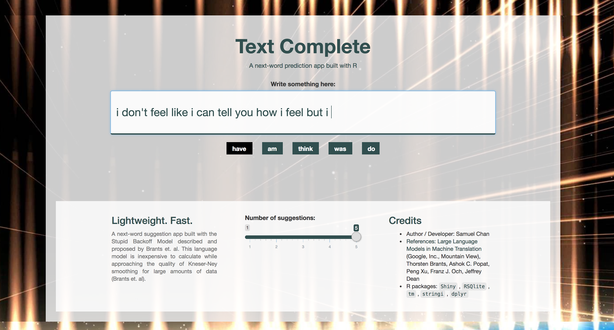

# Text Complete
[Text Complete](https://samuelc.shinyapps.io/textcomplete/) is an app that suggest a list of the most likely next-word given a string of word. Its industrial use is most noted in keyboard apps, where a smartphone user can benefit from the suggestions and save himself (herself) some precious minutes and make the painful act of texting ~~a lot~~ less painful.

# Components
The text data used to train the language model was sourced from Blog, News articles, and Twitter respectively courtesy of the work done by Hans Christensen (@hc_corpora). I do the necessary pre-processing and these functions are documented in the `helpers` folder. I removed any words inappropriate for mostly kids and sometimes adults from the final data so our app is somewhat cultured in its response and suggestions. Very roughly, these are the steps to produce the final app:

* Process text retrieve from raw textual data  
    + Reading in only a subset of the entire data due to computational costs concerns
* Data cleansing and content transformation techniques  
    + Using the almighty `tm` package
* Remove too infrequent keywords and combination of words 
    + Remove words or combination of words that appear less than 4 times in total in the training dataset
* Some exporatory data analysis
* Creating ngrams and storing them in an `sqlite` file 
    + Unigrams, Bigrams, Trigrams, Quadrigrams, Pentagram in their respective table
    + This makes it possible to improve the app in the future: Just add more ngrams to the table! (Assuming speed and app size isn't a concern)
    + This makes it possible to further flesh out our app for persistent storage so the app learns from new entry and gets "smarter" the more we use it
* Build a `Server` and `UI` for the app
* Within the Server we referenced the Stupid Backoff algorithm we wrote (as with other supporting functions we wrote in the above steps, they are stored in `models.R` (core logic) or the `helpers` (pre-processing and enhancement logic) folder).   

## Pre-requisite and Dependencies

1. `Shiny` - For building our R app
2. `tm` - A text mining package. [Comprehensive documentation here](http://cran.r-project.org/web/packages/tm/vignettes/tm.pdf)  
3. `SnowballC` - Word stemming  
4. `RSQLite` - Interface to SQLite db system 
5. `stringi` - Extra helpers function to deal with strings of text
6. `dplyr` - Make it easier to work with dataframes 

Language Model Reference: [Large Language Models in Machine Translation](http://www.aclweb.org/anthology/D07-1090.pdf)
Idea inspiration: Data Science Program, John Hopkins University

# Tools and Project
The project is completed using R, Shiny, SQLite, RStudio's tools (R Presenter), and other third-party libraries mentioned above. Great thanks to the respective authors and contributors - and everyone in the R / text mining  ecosystem, you guys rock.